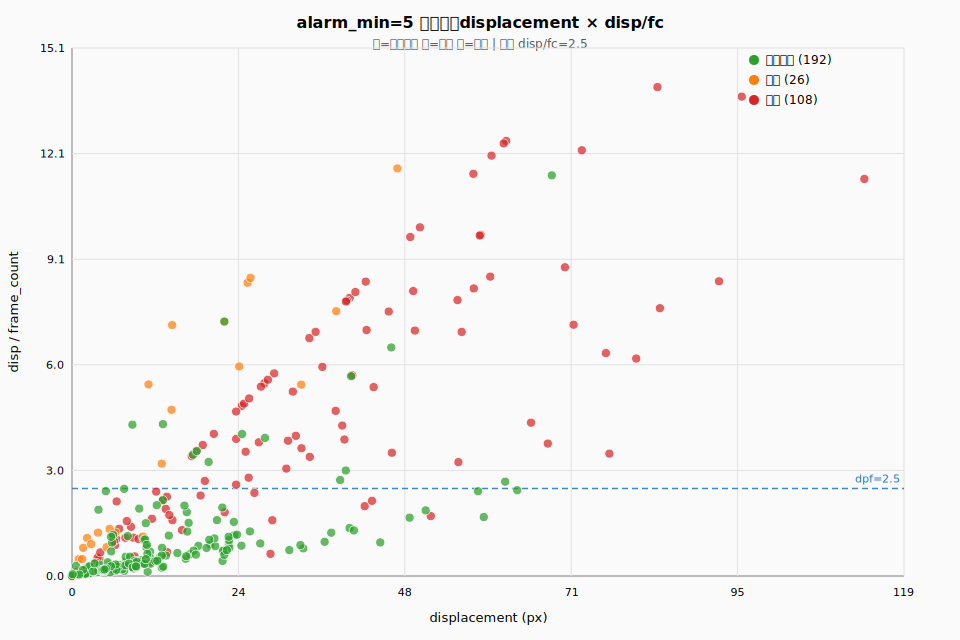

# RTMPose-M alarm_min=5 碰撞段 displacement × disp/fc 分布

> 生成时间：2026-06-23 07:58 UTC  
> 样本：**28** 条（单人, 无遮挡 · 已复核 · 有标真）  
> 机位：1-1-1, 1-2-1, 2-2-2, 2-3-1, 2-4-1, 2-5-1, 2-6-1, 2-7-2  
> 门控：`alarm_min=5` 内存重算告警；**未**施加 disp/fc 段过滤  
> 每个点 = 一条手腕碰撞段，悬停 SVG 查看明细；全量点数据见 `json/alarm-min5-disp-fc-scatter-rtmpose-m.json`  

## 分类说明

| 类别 | 含义 | 段数 | displacement | disp/fc |
|------|------|------|--------------|---------|
| 正确检测 | 与**已检出**标真段重叠的碰撞段 | 192 | P50=9.36 | P50=0.41 |
| 漏报 | 与**漏报**标真段重叠的碰撞段 | 26 | P50=6.22 | P50=1.24 |
| 误报 | 与 alarm_min=5 **误报告警**重叠、且不优先归标真段 | 108 | P50=28.95 | P50=3.82 |

## dpf≤2.5 段过滤（combo4 单条件）

在散点图同一 `alarm_min` 基线上，对候选告警施加 **仅** `displacement/frame_count ≤ 2.5` 的段级确认（与 combo4 一致）。

### 系统级（标真段 vs 告警）

| 指标 | alarm_min 基线 | + dpf≤2.5 | 变化 |
|------|----------------|------------|------|
| 误报 FP | 227 | 141 | **-86** |
| 漏报 FN | 19 | 23 | +4 |
| 召回 recall | 88.7% | 86.3% | -2.4% |

### 误报碰撞段（散点图红点）

- 误报重叠碰撞段 **108** 条；其中 `disp/fc > 2.5`：**68** 条（段级不通过，关联告警易被抑制）
- `disp/fc ≤ 2.5` 仍通过：**40** 条（段过滤后仍可能留下误报）
- **系统级误报减少 86 次**（227 → 141）

## 散点图

参考虚线：`disp/fc = 2.5`（combo4 单条件阈值）。

## 读图提示

- 横轴 displacement、纵轴 disp/fc；`frame_count`/`duration` 在 tooltip 中给出，与 alarm_min 门控时长相关。
- 若误报（红）大量落在虚线下方，说明仅 dpf≤2.5 即可区分；漏报（橙）若在虚线上方，提高 dpf 门槛会加剧漏报。
- 脚本：`scripts/data/plot_alarm_min_disp_fc_scatter.py`
