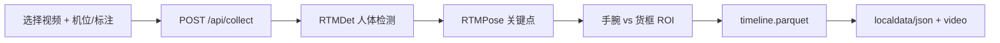
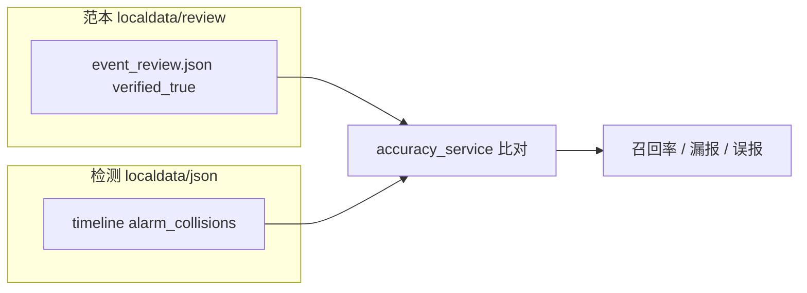

# Web 前端功能说明

本文档描述 `visual-dps-datacollect` Web 单页应用（SPA）各模块的功能原理与使用方法。前端为**无构建工具**的原生 JavaScript，由 FastAPI 静态挂载，默认地址：**http://127.0.0.1:8765**（见 `config.json` → `server.port`）。

```bash
python server.py
# 或指定端口
python server.py --port 8770
```

---

## 1. 整体架构

### 1.1 页面结构

应用由顶部 **四个 Tab** 组成，对应 `web/index.html` 中四个 `section.panel`：

| Tab | 面板 ID | 主要脚本 |
|-----|---------|----------|
| 采集 | `#panel-collect` | `web/app/05-collect.js` 等 |
| 标注 | `#panel-annotate` | `web/annotate.js`、`annotateVisualMode.js` |
| 准确率 | `#panel-accuracy` | `web/accuracy.js` |
| 回放 | `#panel-playback` | `web/app/06-records.js` ~ `11-playback-controls.js` |

Tab 切换逻辑在 `web/app/03-tabs.js`；全局状态与常量定义在 `web/app/00-core.js`。

### 1.2 脚本加载顺序

`index.html` 按依赖顺序加载脚本（共享全局作用域，无需打包）：

1. **公共工具**：`fieldTips.js`、`previewLayout.js`、`collectVideoPreview.js`
2. **标注几何**：`math.js`（CDN）、`annotateGeometry.js`、`annotateVisualMode.js`
3. **回放 / 采集主逻辑**：`web/app/00-core.js` … `11-playback-controls.js`（见 `web/app/README.md`）
4. **独立页签**：`annotate.js`、`accuracy.js`

### 1.3 数据目录（与前端交互相关）

配置见 `config.json` → `paths`：

| 目录 | 用途 |
|------|------|
| `localdata/json/{rtmpose-t\|s\|m}/{机位slug}/` | 骨架记录（Parquet 包 + manifest） |
| `localdata/video/{rtmpose-t\|s\|m}/{机位slug}/` | 采集配套视频 |
| `localdata/json/annotations/` | 货位 ROI 标注 JSON（全局共享） |
| `localdata/review/{机位slug}/{clip_key}/` | 人工事件复核（`event_review.json`） |

**机位标识**（画面右下角文字，如 `1-6组-2`）与存储目录 slug（如 `1-6-2`）的映射由 `reflection.json` 维护；采集、标注、准确率页均依赖该配置。

### 1.4 字段说明「?」按钮

`fieldTips.js` 为带 `class="field-tip"` 的按钮绑定悬停说明（`data-tip` 纯文本）。点击不会提交表单，仅作提示。

---

## 2. 采集页

**目的**：上传本地视频，运行 RTMPose 人体骨架推理，并按货位标注计算手腕进框的**碰撞**与**告警**，结果写入 `localdata`。

### 2.1 功能原理



- **碰撞（collision）**：单帧内手腕（COCO 关键点 9/10，score>0.3）进入货框多边形。
- **告警（alarm）**：同一货框连续命中达到 `alarm_min_consecutive_frames`（默认 3），且距上次告警 ≥ `alarm_cooldown_frames`（默认 12）。
- 标注来源优先级：**上传 JSON** > **机位 reflection 自动装配** > **已存 `annotations/{stem}.json`**。
- 数据按 **姿态模型层**（`rtmpose-t` / `s` / `m`）与 **机位 slug** 分层存储。

### 2.2 采集模式

| 模式 | 说明 |
|------|------|
| **单视频** | 一次处理一个文件，可首帧预览对照机位 |
| **文件夹批处理** | 选择同一机位文件夹内多个视频，仅首帧预览；结果写入该机位子目录 |

批处理**必须**选择机位标识；单视频模式下机位、上传标注、已存标注三选一（或勾选「仅计算骨架」跳过碰撞）。

### 2.3 主要表单项

| 控件 | 含义 |
|------|------|
| 姿态 `collect-backend` | `rtmpose_t` / `s` / `m`，影响精度与速度 |
| 检测 `collect-det` | RTMDet 档位，仓库场景推荐 `m`（640） |
| 推理宽/高 | 输入缩放；宽为 0 时按高度等比 |
| `frame_rate` | 采集节拍上限（非视频 FPS）；0=尽快跑完 |
| `pose_frame_interval` | 每隔 N 源帧推理一次 |
| `max_pose_frames` | 最多写入帧数；0=不限制 |
| 保存配套视频 | 副本写入 `localdata/video` |
| 仅计算骨架 | 不计算碰撞，回放时显示「碰撞未计算」 |
| 机位标识 | `reflection.json` 的 `camera` 列表 |
| 标注 JSON 上传 | 可选，覆盖 reflection |
| 碰撞参数 | `alarm_min_consecutive_frames`、`alarm_cooldown_frames`；会同步到 localStorage，回放补算时复用 |

### 2.4 使用步骤（单视频）

1. 选择视频文件。
2. 对照首帧预览，在「机位标识」下拉中选择与画面右下角一致的文字。
3. 确认页面上方标注状态为绿色（reflection 或已存标注可用）。
4. 按需调整模型与推理参数，点击 **开始采集**。
5. 完成后到 **回放** 页查看记录；记录管理与删除均在回放页进行。

若缺少标注，状态栏会提示 **去标注页**，在标注 Tab 按机位编辑 ROI 后返回采集。

### 2.5 相关 API

| 方法 | 路径 | 说明 |
|------|------|------|
| GET | `/api/reflection/cameras` | 机位下拉列表 |
| GET | `/api/reflection/lookup?camera=` | 校验机位与将装配的标注文件 |
| GET | `/api/annotations/by-video/{stem}` | 检查已存标注 |
| POST | `/api/collect` | 提交采集任务 |
| GET | `/api/jobs/{id}` | 轮询任务进度 |

---

## 3. 标注页

**目的**：编辑 `localdata/json/annotations/{编号}.json`，调整货架透视与货位 ROI；保存后**全局生效**（采集、碰撞重算、回放叠加均使用该文件）。

### 3.1 功能原理

标注页**不播放视频**，仅加载该机位下**已采集视频的首帧**作为 Canvas 背景，交互对齐现场 **visual-dps**：

1. **绿色四角**：货架透视边界（`shelf_corners`）。
2. **行列网格**：`grid_shape`（默认 4×4），点「生成货位」按透视切分。
3. **橙色四边形**：每个货位（`boxes[].video_polygon`），可拖角点、平移、改 `box_id`。

坐标同时保存像素值 `video_polygon` 与归一化值 `video_polygon_norm`；显示时通过 `previewLayout.js` 按 `annotation_size` 与当前首帧分辨率缩放。

```mermaid
flowchart TD
  A[选择模型 + 机位 + 货位编号] --> B[GET /api/annotate/frame]
  B --> C[首帧绘制到 Canvas]
  A --> D[GET /api/annotations/by-video/{id}]
  D --> E[叠加已有 ROI]
  E --> F[编辑]
  F --> G[PUT /api/annotations/by-video/{id}]
```

### 3.2 控件说明

| 控件 | 说明 |
|------|------|
| 姿态模型 | 决定从 `localdata/video/{模型}/{机位}/` 取哪条内置视频的首帧 |
| 机位（机组） | 来自 `reflection.json`；同一机位可对应 2 个 annotation（如 `71`、`72`） |
| 货位标注 | 选择要编辑的 `annotations/{编号}.json` |
| 网格行/列 | 1–8，生成货位前设定 |
| 生成货位 | 根据四角透视生成可编辑货位网格 |
| 货位编号 | 选中货位后修改 `box_id` |
| 保存标注 | 写入 `annotations/{编号}.json` |
| 重新加载 | 重新拉取首帧与 JSON |
| 重置货架 | 清空当前编辑状态，保留首帧 |
| 下载当前 JSON | 导出当前标注文件 |

选择机位后会**自动**加载首帧与标注；若 JSON 尚未创建，可在首帧上新建后保存。

### 3.3 操作步骤

1. 选择 **姿态模型**（与待评估/采集的模型层一致，便于对照同一机位视频）。
2. 选择 **机位**，再选择 **货位标注**（双货架机位选 `71` 或 `72` 之一）。
3. 目视首帧与叠加网格是否对齐；若货位未显示，点 **生成货位**。
4. 拖动绿色/橙色角点微调，必要时修改货位编号。
5. 点击 **保存标注**。

### 3.4 标注 JSON 结构（摘要）

```json
{
  "annotation_size": { "width": 1920, "height": 1080 },
  "source_info": {
    "video_stem": "71",
    "source_video": "xxx.mp4",
    "shelf_code": "71"
  },
  "shelves": [{
    "shelf_code": "71",
    "shelf_corners": [[x,y], ...],
    "grid_shape": [4, 4],
    "boxes": [{
      "box_id": "1",
      "layer": 1,
      "column": 1,
      "video_polygon": [[x,y], ...],
      "video_polygon_norm": [[0.1, 0.2], ...]
    }]
  }]
}
```

### 3.5 相关 API

| 方法 | 路径 | 说明 |
|------|------|------|
| GET | `/api/reflection/cameras` | 机位列表 |
| GET | `/api/annotate/context` | 机位 → annotation 列表与视频信息 |
| GET | `/api/annotate/frame` | 内置视频首帧（Base64 JPEG） |
| GET | `/api/annotations/by-video/{id}` | 读取标注 |
| PUT | `/api/annotations/by-video/{id}` | 保存标注 |

### 3.6 前端模块

| 文件 | 职责 |
|------|------|
| `annotate.js` | 页签逻辑、API 调用、保存 |
| `annotateVisualMode.js` | Canvas 交互（角点、货位、选中） |
| `annotateGeometry.js` | 透视变换、点在多边形内 |
| `previewLayout.js` | 标注坐标 ↔ 视频帧坐标换算 |

---

## 4. 准确率页

**目的**：以人工复核为「金标准」，衡量当前模型 + ROI 下**告警检测**的效果，用于评估标注调整是否有效。

### 4.1 功能原理



**纳入评估的分片**（重要）：

- 仅 `event_review.json` 中 **`status = completed`（已复核）** 的分片参与测试。
- **`no_collision`（无碰撞）** 及未复核、复核中等状态：**直接排除**，不出现在统计与明细中。

**范本货框**（每条 `verified_true`）：

- 优先 `confirmed_box_tokens`（人工确认的取货货框）。
- 若为空，则使用 `box_tokens`。

**评估规则**：

| 规则 | 说明 |
|------|------|
| 取货段合并 | 按 `frame_idx` 排序后，**连续** `verified_true` 且范本货框相同 → 合并为 `[frame_start, frame_end]` |
| 检出成功 | 该段时间内，timeline 出现**匹配货框**的 **告警**（`alarm_collisions`，不是瞬时碰撞） |
| 漏报 | 一段内无任何匹配告警 → 记 **1 次**漏报 |
| 误报 | 某帧告警不在任一段的时间 + 货框范围内 → 记 **1 次**误报 |

同一 `review_key` 下，不同姿态模型层（t/s/m）共用一份人工复核；评估时读取**所选模型层**下匹配的 pose 记录 timeline。

### 4.2 使用步骤

1. 打开 **准确率** Tab。
2. 选择 **姿态模型**（如 `rtmpose-m`）。
3. 选择 **机位**（下拉仅显示有已复核范本数据的机位，括号内为已复核分片数）。
4. 查看上下文提示：已复核分片数、当前模型层可匹配的 pose 记录数。
5. 点击 **批量评估**，查看汇总指标与分片明细表。

### 4.3 输出指标

| 指标 | 含义 |
|------|------|
| 评估分片 | 已复核且进入测试池的分片数；其中成功评估 / 跳过（如无 `verified_true`） |
| 范本取货段 | 合并后的 ground truth 段总数 |
| 检出成功 | 段内有匹配告警的段数 |
| 漏报 | 段内无匹配告警的段数 |
| 误报 | 段外告警事件次数 |
| 召回率 | 检出成功 / 范本取货段 |
| 漏报率 | 漏报 / 范本取货段 |
| 精确率（代理） | 检出成功 / (检出成功 + 误报) |

### 4.4 相关 API

| 方法 | 路径 | 说明 |
|------|------|------|
| GET | `/api/accuracy/cameras` | 有已复核 review 的机位 |
| GET | `/api/accuracy/context` | 机位下可评估分片与记录匹配情况 |
| POST | `/api/accuracy/evaluate` | 批量评估（body: `pose_tier`, `camera`） |

后端实现：`api/accuracy_service.py`。

---

## 5. 回放页

**目的**：加载已保存骨架记录，同步播放视频与骨骼叠加；进行**事件复核**（标真、确认货框）；支持筛选、标签与导出。

### 5.1 布局

| 区域 | 内容 |
|------|------|
| 左侧 | 记录列表、筛选、手动导入 JSON/视频 |
| 中间 | 视频 + Canvas 叠加（骨架、货框、碰撞/告警高亮） |
| 右侧 | 事件复核面板（队列、标真、货框点选） |

### 5.2 记录列表与筛选

**列表层级**：先按 **机位目录** 分组，展开后显示该目录下各条记录。

| 筛选项 | 说明 |
|--------|------|
| RTMPose 模型层 | `rtmpose-t` / `s` / `m` |
| 搜索 | 名称 / 路径关键字 |
| 复核状态 | 全部 / 已复核 / 无碰撞 / 复核中 / 未复核 |
| 标真 | 是否有 `verified_true` 条目 |
| 标签 | 逗号分隔，需全部匹配 |

**操作**：

- 单击选中记录 → **加载并回放**（或双击行直接加载）。
- 行内可下载 JSON、导出 XLSX、删除记录（不删除 `review_dir` 共享复核）。

### 5.3 回放渲染原理

1. 加载记录 `manifest.json` 与分页 **frames**（`GET /api/records/{id}/frames?from_frame=&to_frame=`）。
2. 每块默认 120 帧（`FRAME_CHUNK_SIZE`），播放时预取相邻块。
3. Canvas 按 `object-fit: contain` 与视频对齐（`01-layout-frames.js`、`07-playback-stage.js`）。
4. `10-render-collision.js` 绘制：
   - COCO-17 骨架连线（score ≥ 0.3）；
   - 货框：淡绿普通货架、紫色当前人工确认、黄框碰撞、红框告警。
5. 碰撞/告警数据来自每帧的 `collisions` / `alarm_collisions`；事件列表由 `load_events` 派生（告警与「仅碰撞」分列）。

### 5.4 手动导入

折叠面板 **手动导入 JSON / 视频**：无已保存记录时，可本地选 pose JSON；可选补充标注 JSON 与替换视频。导入视频为临时 Object URL，离开回放 Tab 或停止播放后会释放。

### 5.5 事件复核

复核数据持久化在 `localdata/review/{机位}/{clip_key}/event_review.json`，与 pose 模型层解耦（同一视频片段时间窗共享一份复核）。

#### 复核状态

| status | 含义 |
|--------|------|
| `not_started` | 未开始 |
| `in_progress` | 复核中 |
| `completed` | 已复核（准确率评估仅使用此状态） |
| `no_collision` | 无碰撞（准确率评估排除） |

#### 标真与货框确认

- 右侧 **事件复核** 队列按筛选（全部 / 未标真 / 待确认货框 / 已标真 / 告警 / 碰撞）浏览事件。
- **标为真**：将事件写入 `verified_true`，并可确认 `confirmed_box_tokens`（画面上点选货框，紫色高亮）。
- 切换事件时，未按 **Y** 保存的暂选货框会丢弃。
- **标记复核完成**：将 review `status` 设为 `completed`。

#### 画面货框颜色

| 颜色 | 含义 |
|------|------|
| 淡绿细线 | 普通货架货框 |
| 紫色填充 | 当前已选人工 box（含暂选） |
| 黄色描边 | 碰撞 |
| 红色描边 | 告警 |

#### 快捷键（回放页聚焦时）

| 键 | 功能 |
|----|------|
| `Space` | 播放 / 暂停 |
| `Y` | 标为真并下一条 |
| `N` / `J` | 下一条（不标真） |
| `U` | 取消标真并下一条 |
| `↑` / `↓` | 上一条 / 下一条事件 |

### 5.6 播放控制

- 倍速 0.5×–8×、进度条（带事件标记）、停止回放。
- 可 **导出 Excel**（当前记录骨架与事件）。

### 5.7 相关 API（摘要）

| 方法 | 路径 | 说明 |
|------|------|------|
| GET | `/api/records` | 记录列表（多筛选参数） |
| GET | `/api/records/{id}` | 元数据 |
| GET | `/api/records/{id}/frames` | 分页帧（含骨架与碰撞） |
| GET | `/api/records/{id}/events` | 事件 + 复核 enriched |
| GET/PATCH | `/api/records/{id}/event-review` | 读写复核 JSON |
| GET | `/api/records/{id}/annotation.json` | 记录关联标注 |
| GET | `/api/records/{id}/export.xlsx` | 导出 Excel |
| POST | `/api/records/{id}/recompute-collisions` | 按新 ROI 重算碰撞 |

### 5.8 回放子模块（`web/app/`）

| 文件 | 职责 |
|------|------|
| `00-core.js` | 全局状态、COCO 常量、面板引用 |
| `01-layout-frames.js` | 布局换算、帧分块拉取与缓存 |
| `02-playback-selection.js` | 记录选中、离开 Tab 挂起播放 |
| `03-tabs.js` | Tab 切换、采集/标注/准确率初始化钩子 |
| `04-collision-config.js` | 碰撞参数 localStorage |
| `05-collect.js` | 采集表单（见第 2 节） |
| `06-records.js` | 记录列表 UI、标签、分组 |
| `07-playback-stage.js` | 视频/Canvas DOM、尺寸监听 |
| `08-event-review.js` | 标真、货框确认、PATCH 串行保存 |
| `09-playback-events.js` | 事件列表、seek、与播放联动 |
| `10-render-collision.js` | 骨架与货框绘制 |
| `11-playback-controls.js` | 播放按钮、快捷键、页面 init |

---

## 6. 典型工作流

### 6.1 新机位首次上线

1. 准备 `reflection.json` 与 `annotations/{编号}.json`（或在 **标注** 页创建）。
2. **采集** 页选机位与视频，完成骨架 + 碰撞采集。
3. **回放** 页复核事件，确认货框后标真，**标记复核完成**。
4. 调整 ROI 后在 **标注** 页保存，必要时对记录 **重算碰撞**（回放页或 API）。
5. 在 **准确率** 页选择模型与机位，**批量评估** 告警召回与误报。

### 6.2 仅补骨架、后补碰撞

1. 采集时勾选 **仅计算骨架**。
2. 在 **标注** 页完成 ROI。
3. 回放记录行或通过 API 执行 **重算碰撞**（复用已有骨架，不重新推理姿态）。

### 6.3 对比不同 RTMPose 档位

- 同一机位视频可对 `rtmpose-t` / `s` / `m` 各采集一份（分目录存储）。
- **回放** 页切换模型层筛选记录。
- **准确率** 页分别选择模型层评估；人工 review 范本共用，便于横向对比 ROI 在不同骨架质量下的告警表现。

---

## 7. 常见问题

| 现象 | 可能原因 | 处理 |
|------|----------|------|
| 采集提示缺少标注 | 未选机位且无已存 JSON | 标注页保存或上传 JSON |
| 标注页只有视频无货框 | 首帧与 `annotation_size` 不一致导致坐标未映射 | 强制刷新；确认 `annotate.js` 已加载；重新选择机位 |
| 回放无货框 | 记录未关联标注或「碰撞未计算」 | 检查 annotation；或重算碰撞 |
| 准确率评估 0 片 | 该机位无 `completed` 复核 | 回放页完成复核并标记完成 |
| 准确率跳过较多 | 已复核但 `verified_true` 为空 | 回放标真后再评估 |
| 批处理失败 | 未选机位 | 批处理必须选择 reflection 机位 |

---

## 8. 参考文档

- 复核数据迁移：`docs/migrate-event-review.md`
- 回放脚本模块拆分：`web/app/README.md`
- 项目总览与配置：`README.md`
